# Zabbix Network Alerting Workflow Lab (Triggers, Actions, SMTP Alerts)

<br>


## Overview:

This lab demonstrates the setup of a basic Zabbix monitoring and alerting system. It includes configuring a monitored host (guest VM), collecting metrics, defining trigger conditions, and sending email notifications using SMTP. The goal is to understand how Zabbix detects issues and generates alerts based on system performance data. We are using Zabbix Server on Ubuntu - along with two other Ubuntu VM hosts/clients. 

## Objectives:

Deploy a functional Zabbix network monitoring environment on Ubuntu
<br>Configure and register monitored hosts
<br>Collect system metrics (e.g., CPU, memory, or availability)
<br>Create triggers to detect defined threshold conditions
<br>Configure actions to respond to trigger events
<br>Set up SMTP for email-based alerting
<br>Validate alerting by simulating a failure or threshold breach
<br>Understand the end-to-end flow of monitoring data to alert notification

## Test Scenarios with Triggers, Actions, & Email Alerts

Monitor CPU and RAM utilization on hosts by spiking the load with Linux stress-ng CLI tool 
Test Zabbix host agent process down / not available 
Utilize iperf3 Linux CLI tool to generate interface traffic on both hosts


<br>

### Virtual Machines:

Ubuntu 64-bit VM1 with Zabbix Server running on backend, with web GUI frontend. 
<br>Ubuntu 64-bit monitored VM2 running with Zabbix agent (acting as host) 
<br>Ubuntu 64-bit monitored VM3 running with Zabbix agent (acting as host)

Zabbix server dashboard

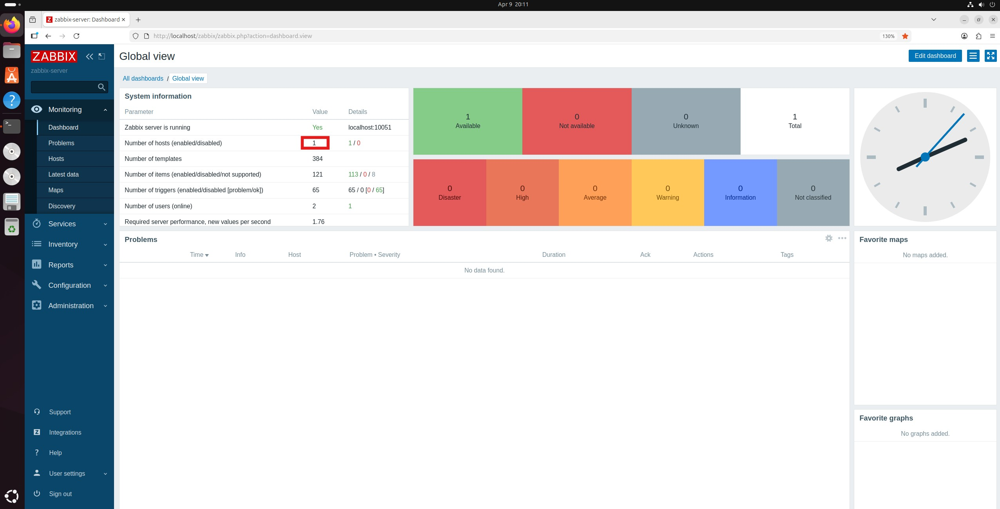

2 Monitored VM hosts


# Zabbix server installation:

Install a Ubuntu VM or another distro - In this project we are using VMware Workstation with 4 CPU cores, 8GB RAM, 50GB storage, NAT network access with host machine.

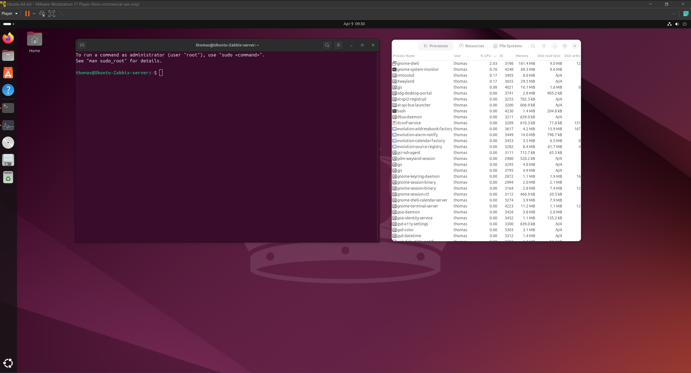

First we update the apt catalog by running:

```
sudo apt update
```

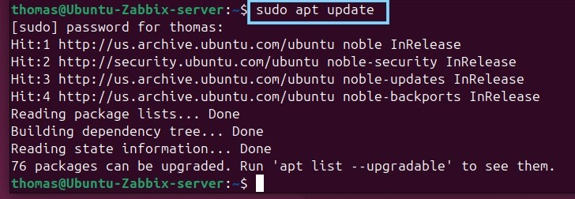

We now use official Zabbix repo to fetch download & installer:

```
wget https://repo.zabbix.com/zabbix/6.0/ubuntu/pool/main/z/zabbix-release/zabbix-release_latest_6.0+ubuntu24.04_all.deb
sudo dpkg -i zabbix-release_latest_6.0+ubuntu24.04_all.deb
sudo apt update
```

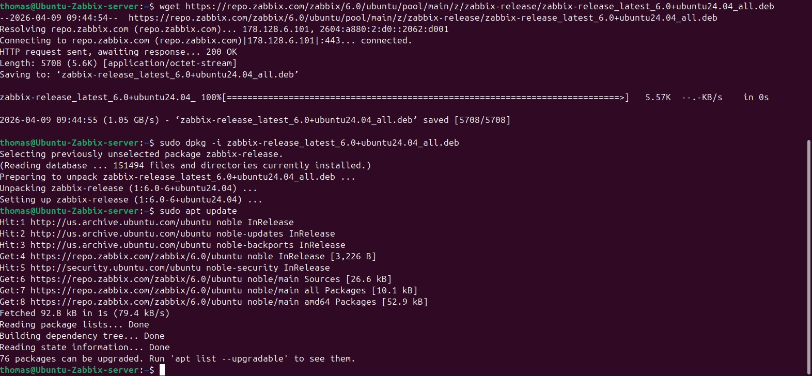

## Install Zabbix + MySQL + Apache

```
sudo apt install zabbix-server-mysql zabbix-frontend-php zabbix-apache-conf zabbix-sql-scripts zabbix-agent mysql-server -y

sudo mysql_secure_installation
```

<br>

```
sudo mysql -uroot -p

CREATE DATABASE zabbix CHARACTER SET utf8mb4 COLLATE utf8mb4_bin

CREATE USER 'zabbix'@'localhost' IDENTIFIED BY 'StrongPassword'

GRANT ALL PRIVILEGES ON zabbix.* TO 'zabbix'@'localhost'

FLUSH PRIVILEGES

EXIT
```

This will install:
<br>Zabbix server
<br>Web UI
<br>Agent
<br>Database
<br>Apache web server

## Install the Zabbix Schema:

On the MySQL CLI, we do a sanity check to make sure DB is working properly and populated with tables:

mysql> SHOW TABLES;

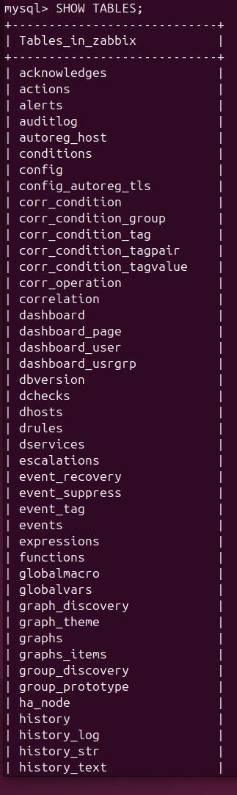

We will add our password to the Zabbix server config daemon process. Remove has # symbol, and add password, exit & 'Y' to save. 

```
sudo nano /etc/zabbix/zabbix_server.conf
```

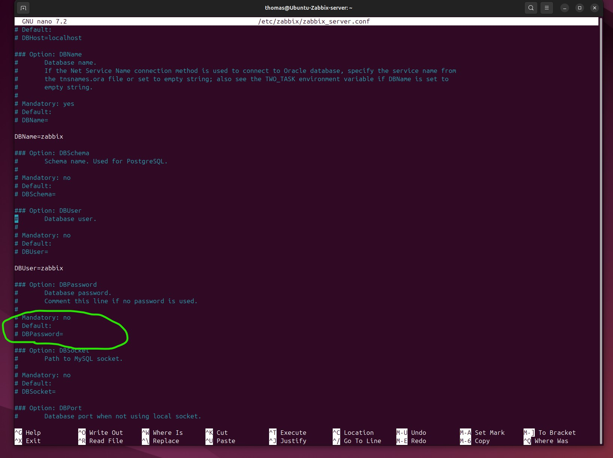

Now we still start Zabbix services:

```
sudo systemctl restart zabbix-server zabbix-agent apache2
sudo systemctl enable zabbix-server zabbix-agent apache2
```


We want to enable Zabbix server to start on each boot:

```
sudo systemctl enable zabbix-server
```

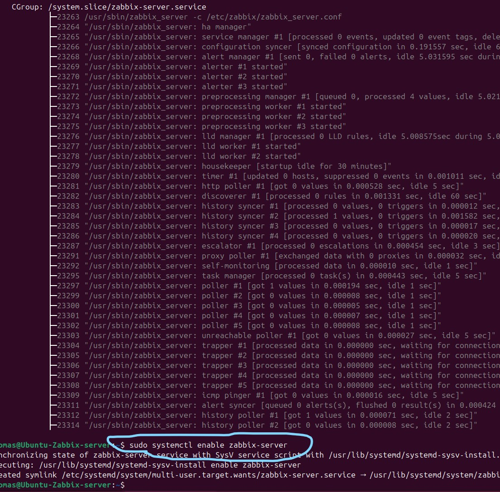

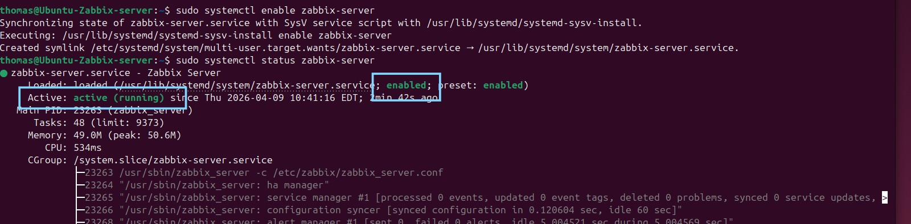

We now can access Zabbix GUI via web browser at http://localhost/zabbix

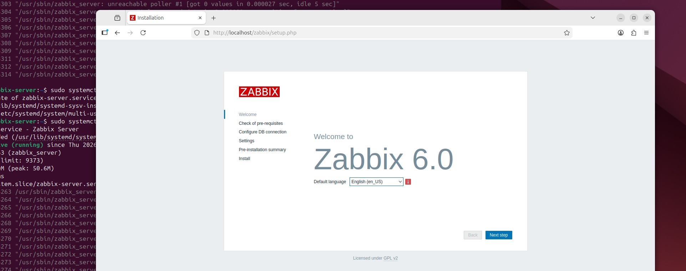

We have to ensure we configure Zabbix correctly on the front-end UI, so that it connects and works correctly with the local MySQL database. 

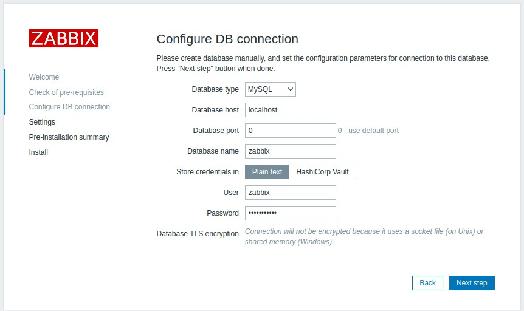

The default admin and pass for Zabbix server when you login is:
<br>Admin
<br>zabbix

Now we can begin configuring monitoring in the GUI:

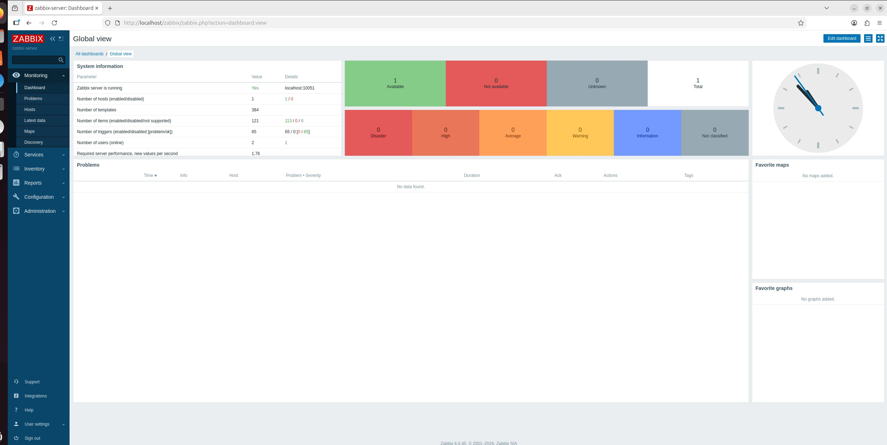


We want to test SMTP email notifications so we configure this first. Port 587. STARTTLS. We also had to use Google's 'App Password' feature for SMTP and we use that App password for the 'password field' in this case to authenticate with smtp@gmail.com. 

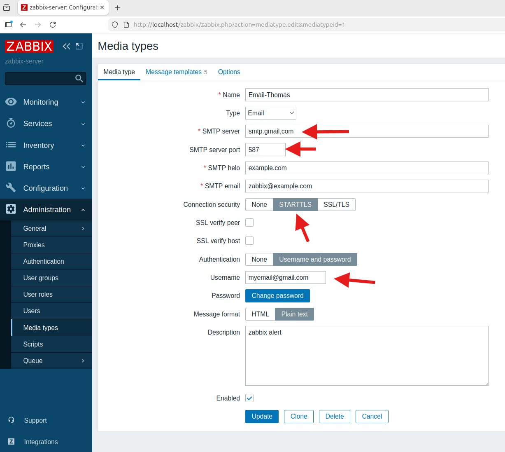

****************************************************************************************************************

## Before going back to the server, we want to get our monitored VMs ready:

We do quick Linux updates for the freshly mounted VM hosts

```
sudo apt update
sudo apt upgrade -y
```

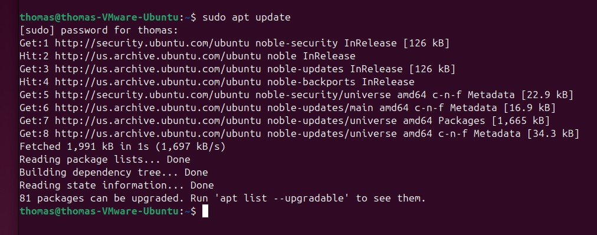


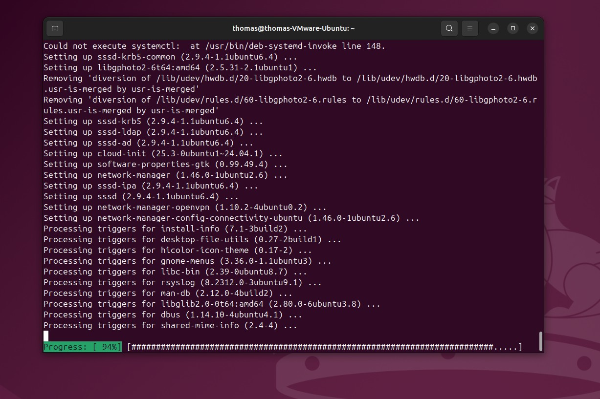


The version of Ubuntu is 24.04.4 and we need the Zabbix repository to be installed before the agent:


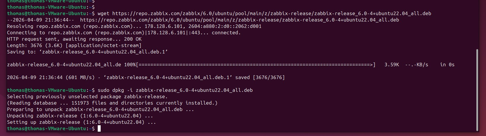


```
sudo apt update && sudo apt upgrade -y

wget https://repo.zabbix.com/zabbix/7.0/ubuntu/pool/main/z/zabbix-release/zabbix-release_latest_7.0+ubuntu24.04_all.deb
sudo dpkg -i zabbix-release_latest_7.0+ubuntu24.04_all.deb

sudo apt update

sudo apt install -y zabbix-agent
```

In the .config file, we update these lines to associated Zabbix server network information:
<br>Server=<ZABBIX_SERVER_IP>
<br>ServerActive=<ZABBIX_SERVER_IP>
<br>Hostname=<THIS_HOST_NAME>

We use this command to enter .conf file, so we can edit the config for our Zabbix server which lives on the server VM. 

```
sudo nano /etc/zabbix/zabbix_agentd.conf
```

We update each .conf file on both monitored hosts (guest VMs). This will allow the agent to speak to the server. 
<br>Server=<192.168.187.129>
<br>ServerActive=<192.168.187.129>
<br>Hostname=<ubuntu-host-1>

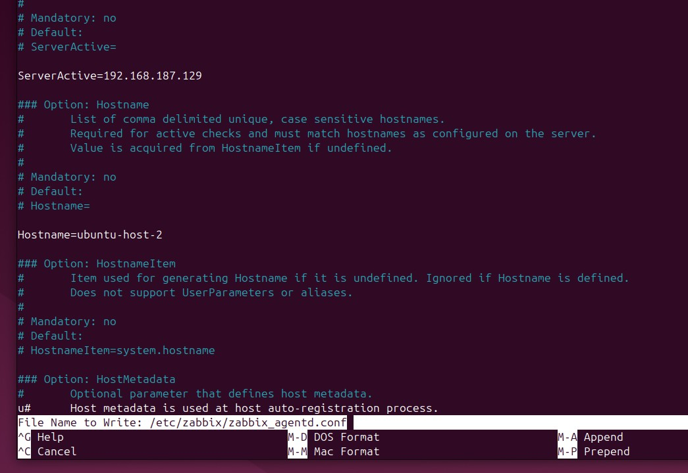

### Our Zabbix server is reachable at inet 192.168.187.129/24

All VM guests are able to reach host machine and internet. IP addresses for all 3 VMS:
<br>Zabbix Server  = 192.168.187.129/24
<br>ubunutu-host-1 = 192.168.187.132/24
<br>ubunutu-host-2 = 192.168.187.123/24

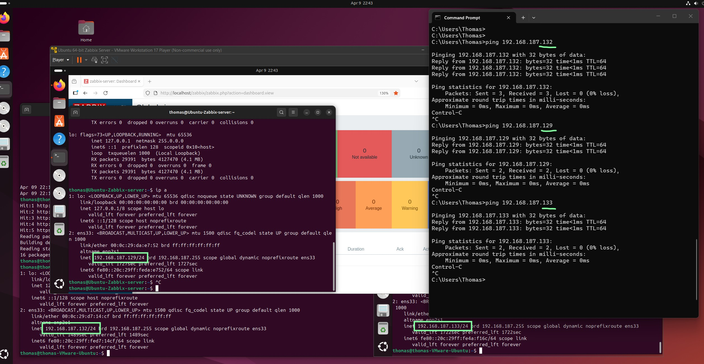

All 3 VMs can ping each other successfully. 

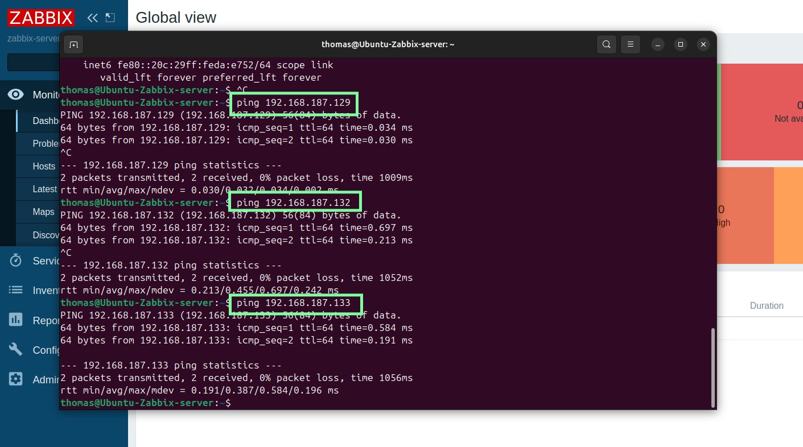

```
sudo systemctl restart zabbix-agent
sudo systemctl enable zabbix-agent
sudo systemctl status zabbix-agent
```

'Status' keyword confirms zabbix agent is active (running) on the VM guest (zabbix monitored host)

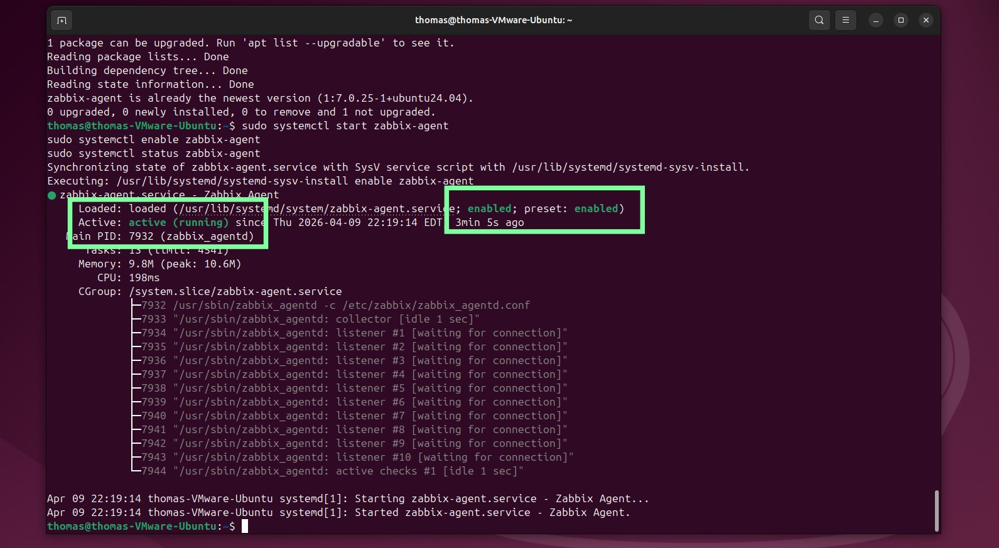

We want to check interfaces on the Linux guests, we run ifconfig (install net-tools if needed). We are using NAT so our VMs can get connectivity
through the host machine running our VM. We ping 8.8.8.8 to make sure we can get out. 

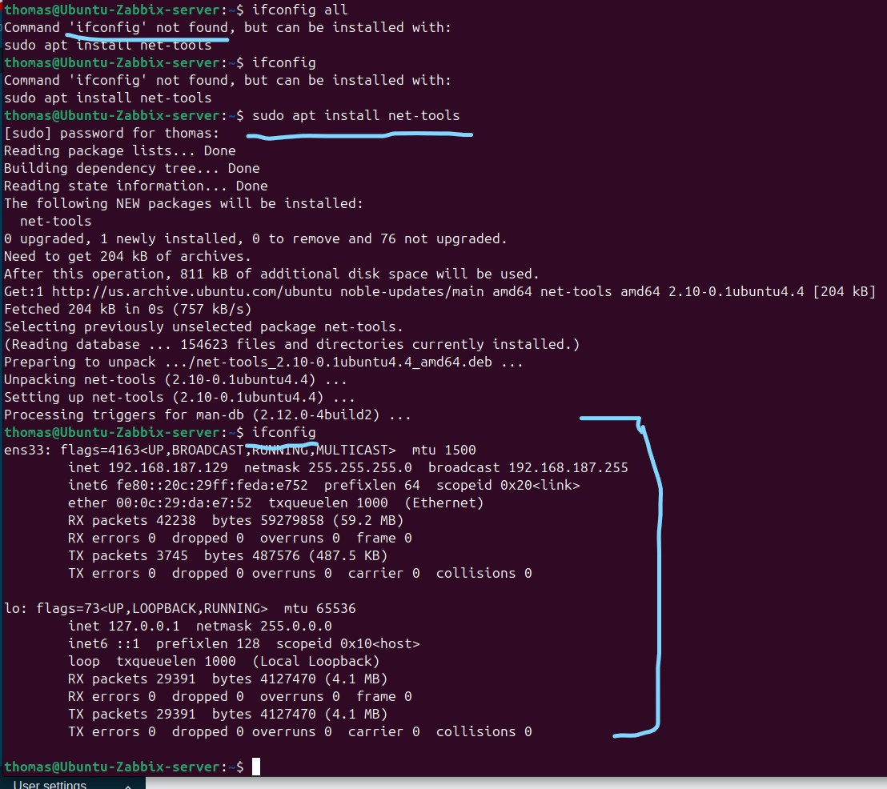

We head back over to Zabbix server VM and now we need to add 2 new hosts (the VMs we're monitoring)

Config > Hosts > Create Host
<br>We add the host name, add 'Linux servers' under the Group selection
<br>Add the IP address of the VM
<br>Port 10050

We make sure each monitored host has a unique hostname - Zabbix won't like duplicate host names. 

```
sudo hostnamectl set-hostname ubuntu-host-1
sudo hostnamectl set-hostname ubuntu-host-2
```

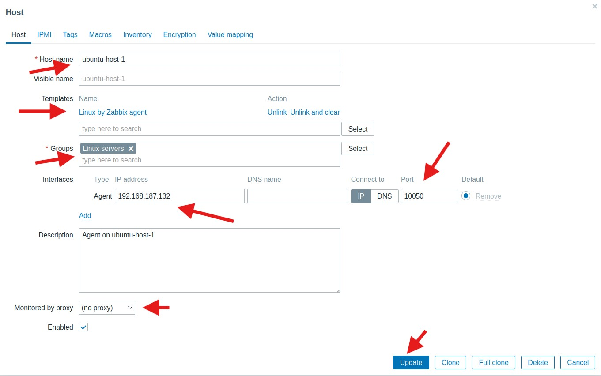

Next, we want to make sure our agents are running and communicating with the server. Grey color means not connected:

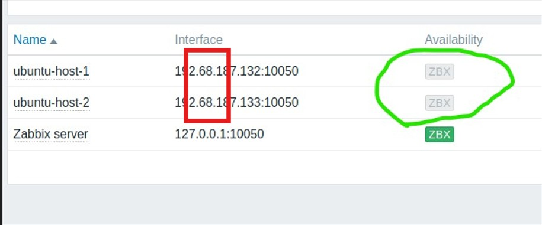


### *I made small mistake, I forgot to add 'Template' when creating & configuring the ubuntu hosts in Zabbix GUI. - This caused the hosts to remain grey and not connected - quick fix*

We will use 'Linux by Zabbix agent' as the template to add. See below:

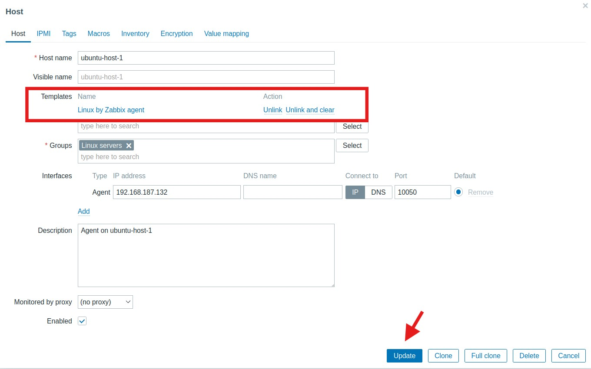

We are making progress but the ZBX 'Availability' icon is red, but we need it to be green, so something is still off:

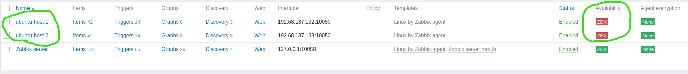

We may have found issue after troubleshooting. Running this command on host 1:

```
sudo tail -f /var/log/zabbix/zabbix_agentd.log
```

Ironically, in the end, it was a simple IP address typo. This is a great example of how you can spend a lot of time
troubleshooting advanced backend issues, when in reality it was a simple config mistake missing 1 digit in the IP address. Whoops.

We can see the agents are now 'green' and connecting successfully to our Zabbix server.

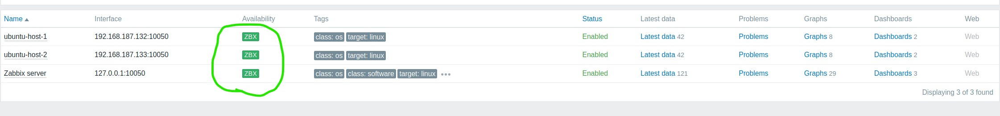

### First we check to make sure our agents are sending frequent updates from the host machines. 

We navigate to Monitoring > Latest Data > look for various data metrics and periodic value changes:

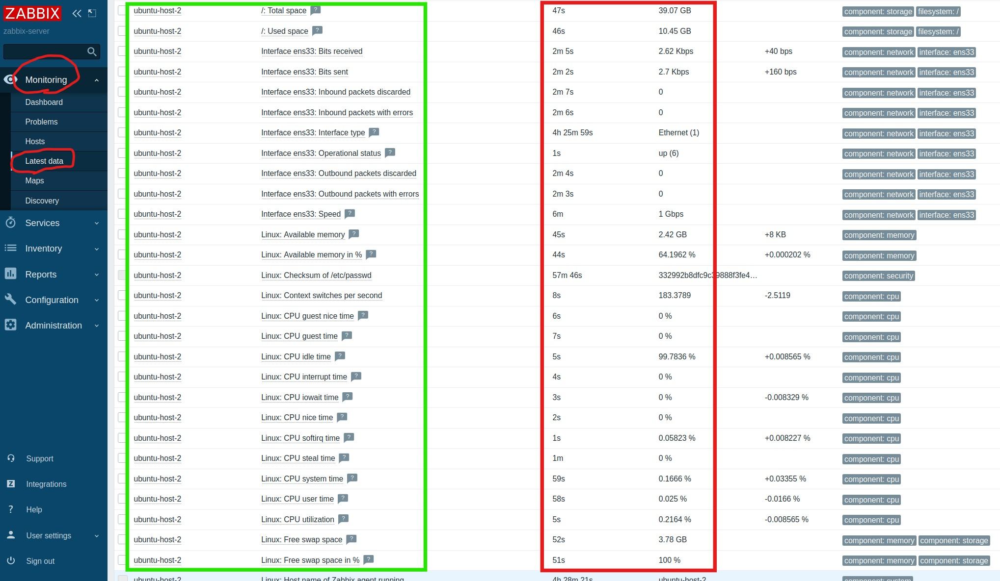

### Now we run a Linux command to stress and put the VM1's CPU under load - to see the CPU utilization difference updated in Zabbix:

We run this command. The 'yes' process string is outputting 'Y' continuously - the /dev/null & throws the 'yes' away so it doesn't appear on screen and runs it in the background. 

Net effect: it burns CPU continuously

```
yes > /dev/null &
yes > /dev/null &
yes > /dev/null &
yes > /dev/null &
```

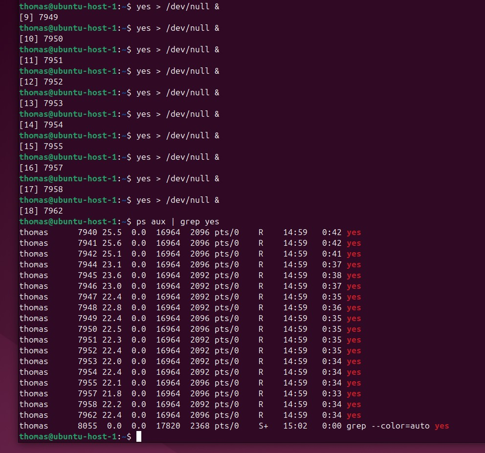

We can also look outside VMware to see my bare metal host machine's CPU utilizing 14% from the 2 cores provisioned on VM1 being flooded at 100% utilization. 

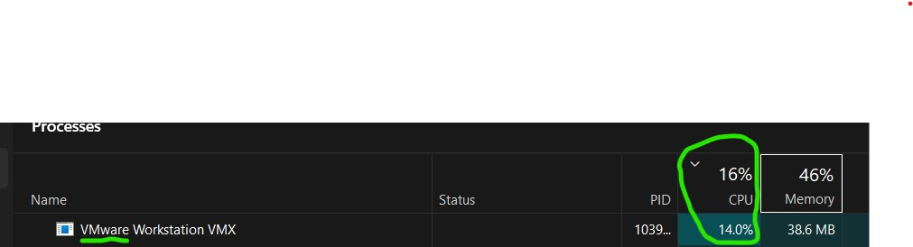

We can monitor ubuntu-host-1 and see it's CPU utilization is holding at 100%. This confirms our Zabbix environment is operating as intended.

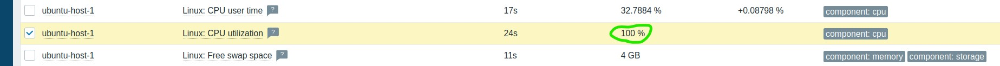

We use this command to stop the processes. *killall stops processes by name (not by PID)*

```
killall yes
```

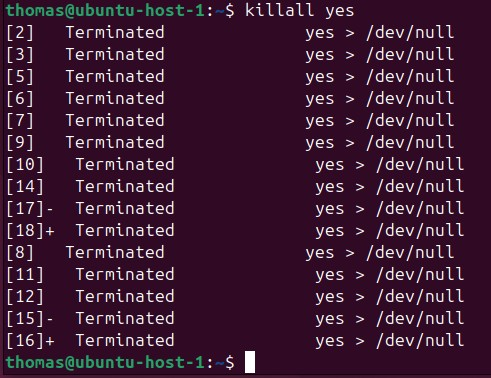

In Zabbix we can see the agent has reported back to the server, letting us know that the ubuntu-host-1's CPU utilization has significantly dropped and is back to less than 1%. 

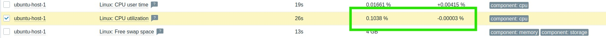

<br>

## Now we create a trigger for ubuntu-host-1 and ubuntu-host-2. 

Configuration → Hosts → we click ubuntu-host-{x} → Triggers → Create trigger

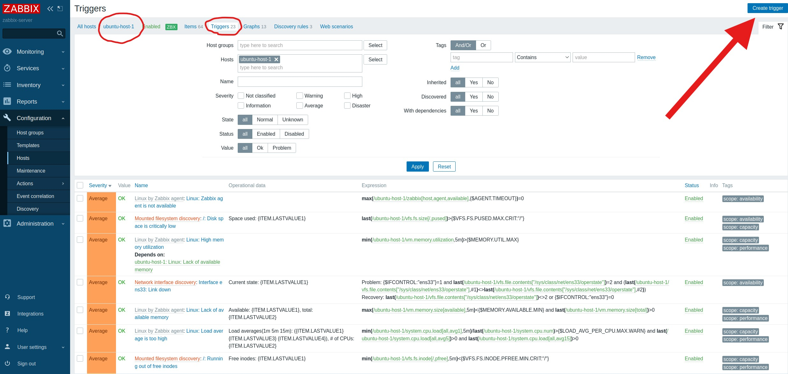

Name: High CPU utilization (>70% for 1m)
<br>Severity: High
<br>We add expression > select > Linux CPU utilization
<br>Function = 
<br>Last of (T) = 1m

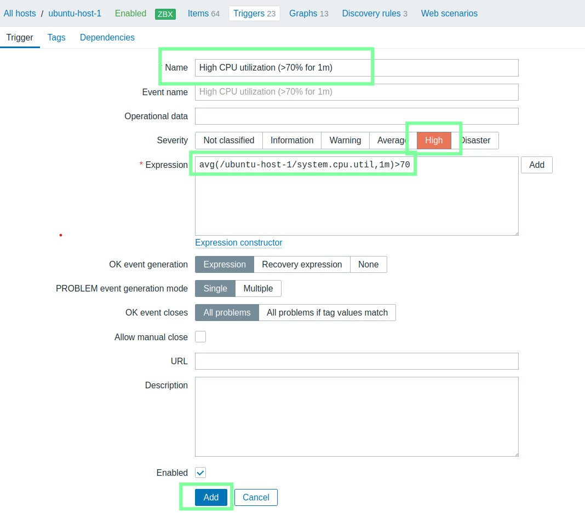


Now that we have the trigger configured, we will again hammer ubuntu-host-1 with the 'yes' process flood to put load on it's CPU. 

Right away the agent on ubuntu-host-1 detects the condition that activates the trigger. The triggered event is now highlighted and blinking
on the main Zabbix dashboard screen under 'Problems'.

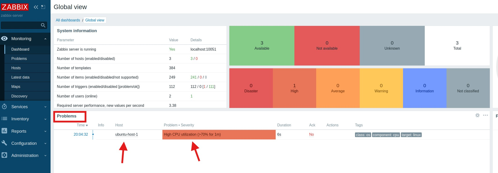

We didn't configure the following - but during set up - there are existing triggers already built-in to the template we chose.

Unexpectedly, we see another trigger alert pop up, and it's telling us the CPU average load is too high. 

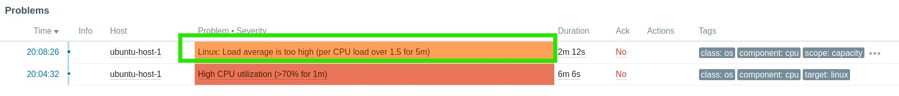

We kill all the processes again and the flashing alerts on the Zabbix dashboard disappear moments later, as the CPU is no longer under any load. 

Next we'll configure an 'Action' to send an 'Alert' via SMTP Email configuration we did earlier. 

Configuration > Actions > Trigger Actions > Create action

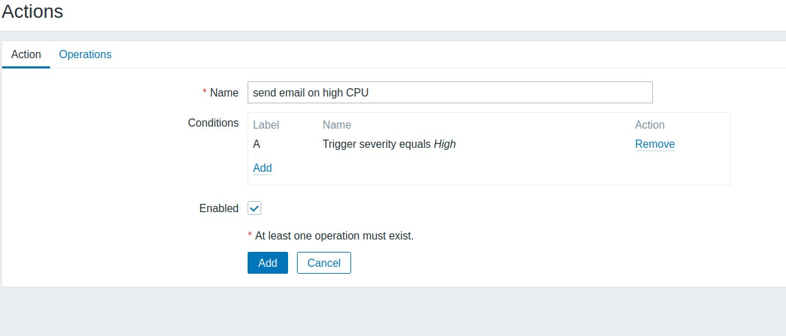

Under the Operations tab, we now have to add the Email action. We want to receive an email alert for our desired trigger, in this case the high CPU utilization on the ubuntu-host-1 VM. 

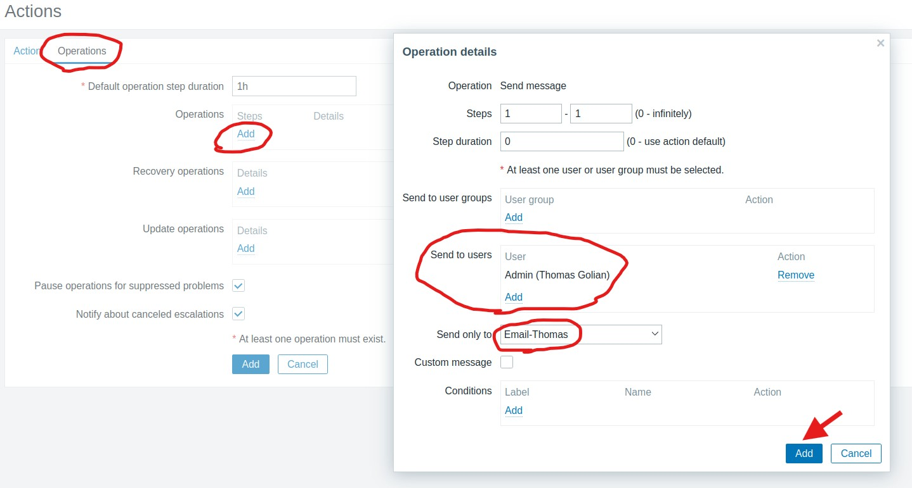

<br>


## Testing our SMTP alerting

Let's again throw a flood of processes on ubuntu-host-1 to put it's CPU on 100% load. We hope to have the trigger event to occur and for the configured trigger action to send an email alert to my Email inbox. All three virtual machines have internet connectivity so it should work in theory.

On first try the Email alert failed: 

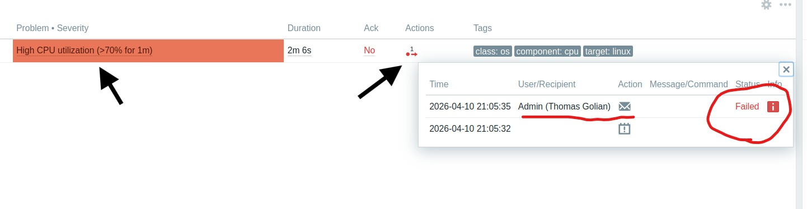

Zabbix is helping us - we can click the Failed red icon to see the error:

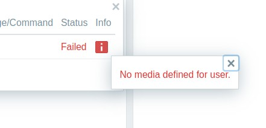

I forgot to configure the 'Media' tab within the Administration > Users section

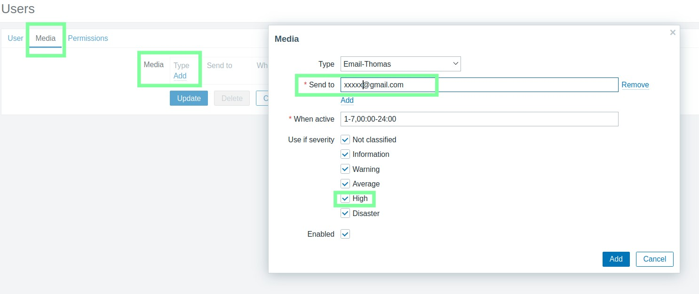

Attempt 2: Whoops, we must have made a mistake with the SMTP Gmail App Password authentication flow. Going back to look at configuration. 

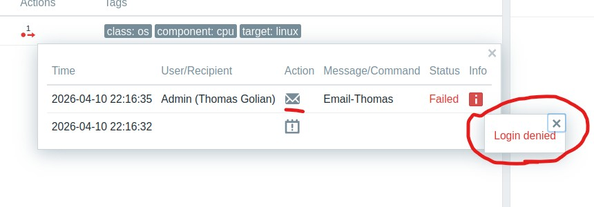

Created a fresh App password for the Zabbix server to use when sending an Email alert and using SMTP to authenticate with Google's servers.

Ran the test again and success this time! You can see Zabbix confirming Email was sent, and I received the alert in the Gmail inbox. 


<br>

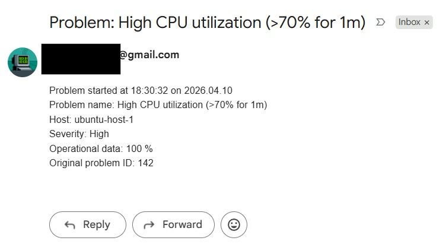


## Let's simulate a failure / lack of communication from Zabbix agent on host 2

We'll run this command on ubuntu-host-2 to simulate a loss of connectivity and/or communication from the agent to the server.

```
sudo systemctl stop zabbix-agent
```

Similar to before, Zabbix detects the agent is down / not available on ubuntu-host-2:

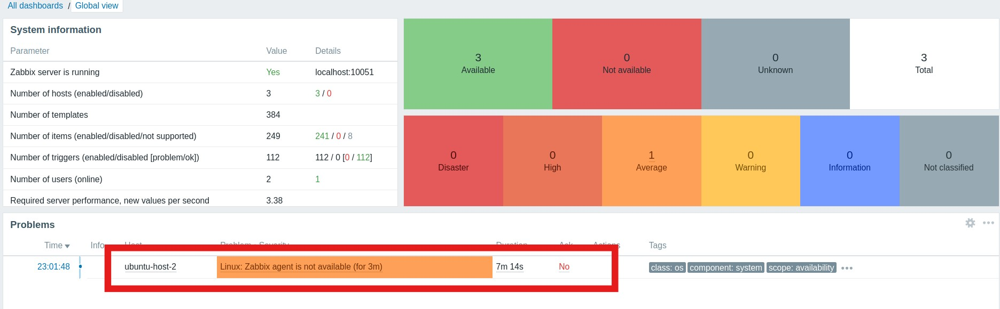

We'll bring the agent back up and alive again. 

## Next we'll try flooding the RAM memory of the host in hopes to see if the agent detects any conditions from the default, pre-set Zabbix Linux agent triggers.

Install 'stress' (The stress command is a command-line utility for Linux and Unix-like systems used to impose artificial, configurable load on CPU, memory, <br>I/O, and disk subsystems. It helps administrators test system stability, thermal management, and identify performance bottlenecks by simulating high-load <br>scenarios, though it is not a benchmarking tool.) *Stress-ng is newer version* 

```
sudo apt install stress-ng -y
```

Command to stress RAM:

```
stress-ng --vm 1 --vm-bytes 95% --timeout 240s
```

We can see the host dispatches 'hogs' to begin consuming memory. (A “hog” = a worker process that aggressively consumes a resource)

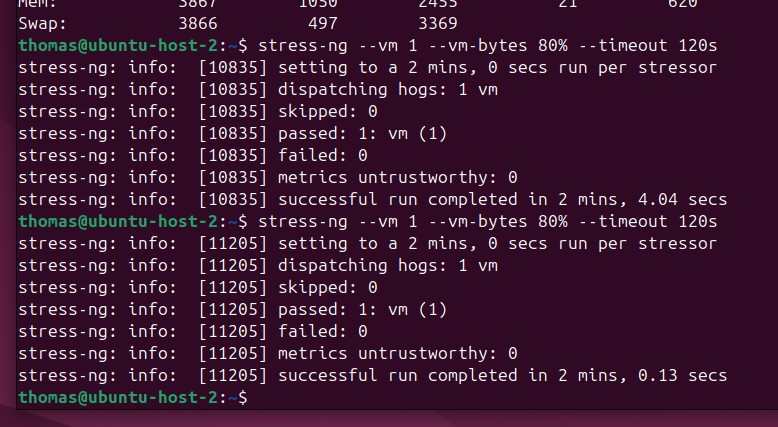

We will open a second terminal tab to run this command to watch RAM memory utilization fluctuations per 1.0 second:

```
watch -n 1 free -m
```

Available RAM should be ~2500 bytes. After running the stress-ng hog process, we can see the avail. memory getting hit down to ~440 bytes:

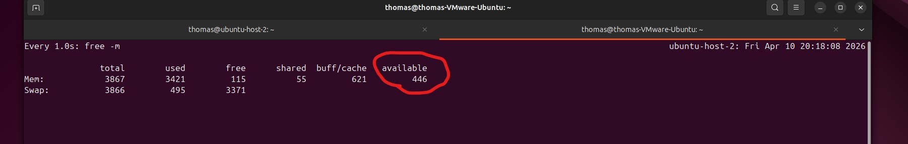

Let's configure another trigger and action for greater than 70% RAM utilization, trigger email alert. Following the same steps as earlier. 

After running the stress command we get a trigger and problem occurring on ubuntu-host-2. Dashboard shows the live event and email notification receives via SMTP. 


<br>

## We're going to use Linux CLI tool 'iperf3' to manually throw traffic through our network interfaces to observe those metrics in Zabbix server:

```
sudo apt update
sudo apt install iperf3
```

We'll choose 'yes' to run daemon process at boot, though it doesn't really matter as we're in a lab and it's lightweight.

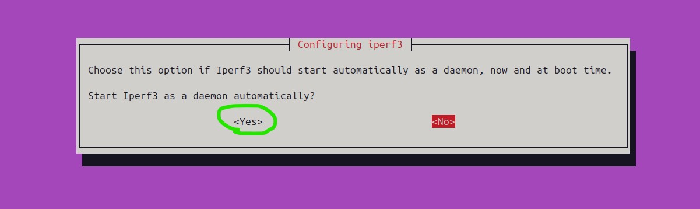

Before testing, we can view host interfaces metrics by navigating to Monitoring > Latest data > filter for 'interface' if needed

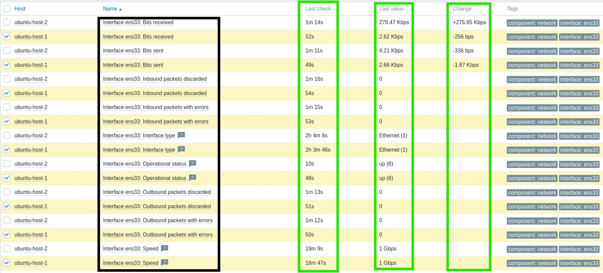

We can also view network traffic visually on a graph. We'll use the pre-built graphs. Before that we will also change how often Zabbix is receiving network
information from the agent. The 'interval'. We navigate to Configuration > Templates > Linux by Zabbix agent (the agent we're using) > Discovery rules > Network interface discovery:

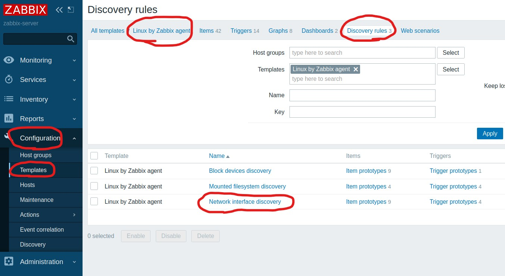

We change the interval to 5 seconds so the graphs will accurately show the change in network bits flowing between host1 and host2

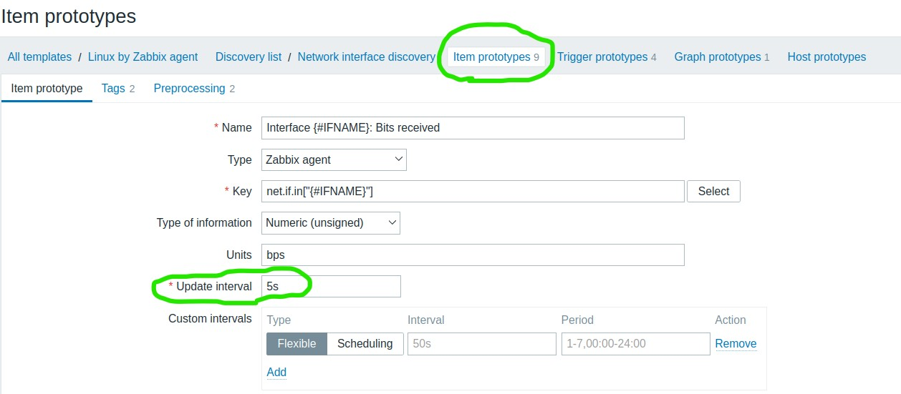

We may also have to change the host's 'network interface discovery' interval to 5s as well:

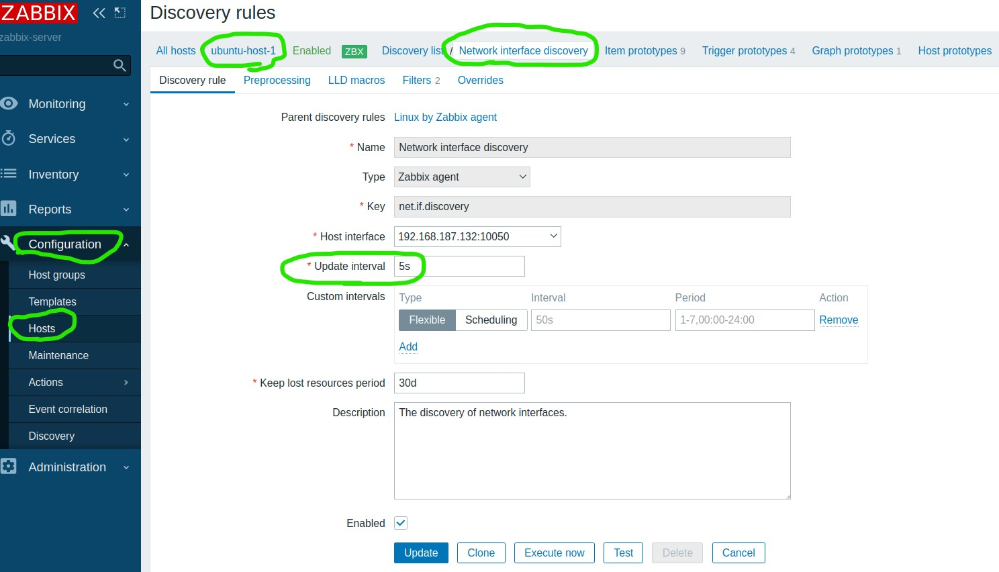

We'll run this cryptic-looking bash shell loop on host2's terminal - sending a dynamic traffic pattern to host1. Bits sent & bits received, respectively. We can visually see the network traffic passing between the virtual machines, and each agent is providing Zabbix server with the data so we can monitor.

```
while true; do
  P=$((RANDOM % 6 + 2))     # 2–7 parallel streams
  T=$((RANDOM % 20 + 10))   # 10–30 seconds duration
  iperf3 -c 192.168.187.132 -P $P -t $T
  sleep $((RANDOM % 10 + 5))  # 5–15 sec idle
done

```

We can also use something simple like:

```
iperf3 -c <HOST_1_IP> -t 120 -P 8
```


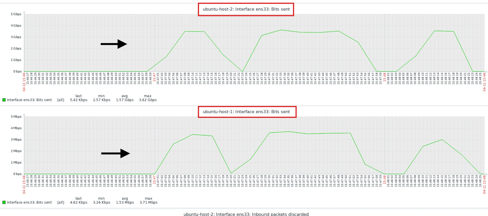


*******************************************************************************************************************

## Key Takeaways

I configured SMTP auth (TLS, ports, app passwords)
Integrated it into a monitoring workflow
Debugged failed delivery + user media config
Validated alerts with live system conditions
Built a fully functional Zabbix monitoring environment with server and agent-based hosts
Successfully configured custom triggers for CPU and memory utilization
Implemented SMTP email alerting using Gmail with app password authentication

Learned to troubleshoot real issues including:
<br>SMTP authentication failures
<br>Missing user media configuration
<br>Incorrect trigger expressions

## Testing & Validation

Generated synthetic CPU load using yes > /dev/null to trigger high CPU alerts

Simulated agent failure by stopping the Zabbix agent service

Created memory pressure scenarios using stress-ng to test memory-based triggers

Watched network traffic visualized through built-in monitoring graphs

## Verified:
<br>Triggers fired correctly
<br>Actions executed as expected
<br>Email notifications were successfully delivered
<br>Agents running on hosts successfully reported back to server with live data gathering

## Key Concepts Demonstrated

Difference between availability vs performance monitoring

Use of time-based trigger functions (avg(1m)) to reduce alert noise

One action handling multiple triggers (scalable alerting design)

Correlation between VM resource usage and host system utilization

Utilized Linux CLI tool iperf3 and bash shell to test interface network traffic between Zabbix hosts

## Final Result

A working end-to-end monitoring and alerting workflow:

System metric → Zabbix agent → Trigger → Action → Email notification

Multiple real-world failure scenarios tested and validated

Alerts reliably generated and delivered

Environment demonstrates practical skills in monitoring, troubleshooting, and alerting design

iperf3 and bash shell tools worked as intended with Zabbix agents monitoring the changes in interface traffic 

*************************************************************************************************************************

<br>


